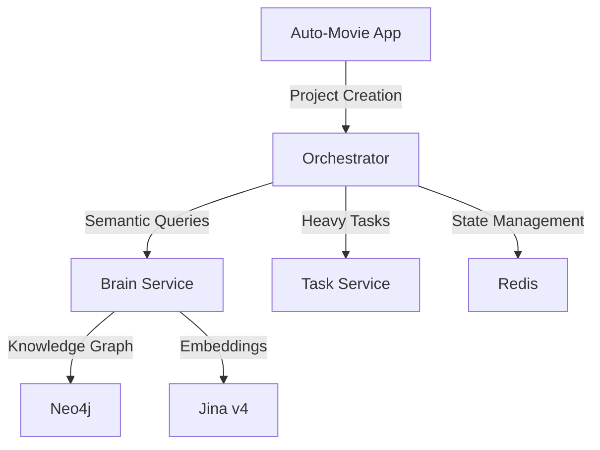

# AI Movie Platform Integration

## 🎬 **Service #7: LangGraph Agent Orchestrator**

### **Position in Platform Architecture:**
- **Local**: `localhost:8003`
- **Dev**: `agents.ngrok.pro` 
- **Prod**: `agents.ft.tc`
- **Purpose**: Coordinates 50+ AI agents for movie production workflows

## 🔗 **Connected Services**

### **Brain Service Integration (Service #3)**
- **URL**: `https://brain.ft.tc`
- **Port**: `8002`
- **Technology**: **Jina v4 embeddings + Neo4j knowledge graph**
- **Protocol**: WebSocket MCP protocol  
- **Purpose**: Knowledge consistency, semantic search, character relationships

### **Task Service Integration (Service #2)**
- **URL**: `https://tasks.ft.tc`
- **Port**: `8001`  
- **Technology**: Celery + GPU processing
- **Protocol**: REST API
- **Purpose**: Video/image generation, audio processing, heavy AI tasks

### **Auto-Movie App Integration (Service #1)**
- **URL**: `https://auto-movie.ft.tc`
- **Port**: `3010`
- **Technology**: Next.js + PayloadCMS
- **Protocol**: REST API  
- **Purpose**: Main dashboard, project management, user interface

### **Neo4j Database (Service #4)**
- **URL**: `https://neo4j.ft.tc` 
- **Ports**: `7474` (HTTP), `7687` (Bolt)
- **Purpose**: Graph database for relationships and knowledge storage

## 📊 **Data Flow Architecture**



## 🚀 **Deployment Configuration**

### **Environment Variables for Platform Integration:**
```bash
# External Service URLs (Production)
AUTO_MOVIE_BASE_URL=https://auto-movie.ft.tc
BRAIN_SERVICE_BASE_URL=https://brain.ft.tc  
TASK_SERVICE_BASE_URL=https://tasks.ft.tc

# Development URLs
AUTO_MOVIE_BASE_URL=https://auto-movie.ngrok.pro
BRAIN_SERVICE_BASE_URL=https://brain.ngrok.pro
TASK_SERVICE_BASE_URL=https://tasks.ngrok.pro
```

### **Port Configuration:**
- ✅ **Correct Port**: `8003` (Service #7 designation)
- ✅ **Health Check**: `https://agents.ft.tc/health`
- ✅ **API Docs**: `https://agents.ft.tc/api/docs`

## 🧠 **Future Enhancement: Jina v4 Integration**

When ready to add semantic capabilities:

1. **Install Jina v4**: `pip install jina[standard]>=4.0.0`
2. **Connect to Brain Service**: WebSocket MCP protocol
3. **Semantic Agent Routing**: Use embeddings for intelligent task assignment
4. **Knowledge Consistency**: Query existing knowledge before creating new content

## 🎯 **Service Readiness Status**

- ✅ **Core Orchestration**: Ready for deployment
- ✅ **Redis State Management**: Fully functional  
- ✅ **API Endpoints**: Complete coverage
- ✅ **Platform Integration**: URLs configured
- ⏳ **Semantic Features**: Ready for Jina v4 enhancement
- ✅ **Production Domain**: `agents.ft.tc` configured

**Status: Ready for Coolify deployment as Service #7** 🚀